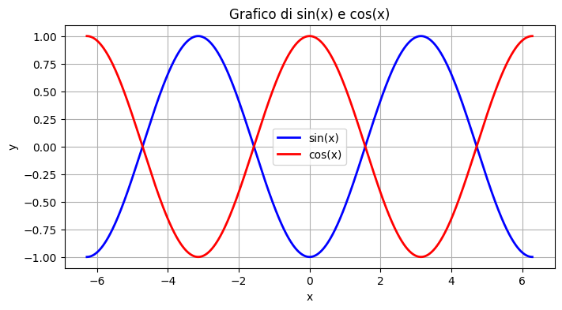
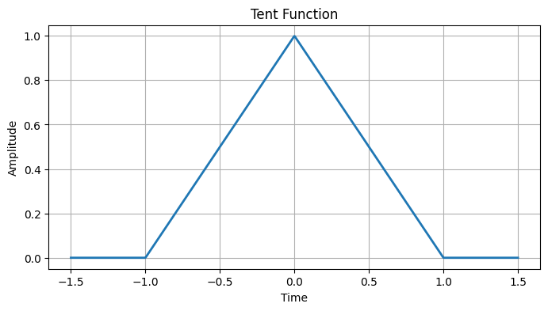

\newpage

# Chapter 2

### Sine-cosine functions

```py
import numpy as np
import matplotlib.pyplot as plt

# Creazione di un array di valori x da -2*pi a 2*pi
x = np.linspace(-2 * np.pi, 2 * np.pi, 1000)

# Calcolo dei valori di sin(x) e cos(x)
sin_x = np.sin(x - np.pi/2)
cos_x = np.cos(x)

# Creazione del grafico
plt.figure(figsize=(8, 4))  # Imposta le dimensioni della figura

# Plot di sin(x) in blu e cos(x) in rosso
plt.plot(x, sin_x, label='sin(x)', color='blue', linewidth=2)
plt.plot(x, cos_x, label='cos(x)', color='red', linewidth=2)

plt.xlabel('x')
plt.ylabel('y')
plt.title('Grafico di sin(x) e cos(x)')
plt.grid(True)
plt.legend()

plt.show()
```



### Triangular function

```py
import numpy as np
import matplotlib.pyplot as plt

# Define parameters
amplitude = 1.0  # Amplitude of the tent function
width = 2.0      # Width of the tent function
center = 0.0     # Center of the tent function
duration = 3.0   # Duration for plotting

# Create a time array
t = np.linspace(center - duration / 2, center + duration / 2, num=1000)

# Create the tent function
tent_function = np.piecewise(t, [t < center - width / 2, (center - width / 2 <= t) &
                             (t <= center + width / 2), t > center + width / 2],
                            [0, lambda t: amplitude * (1 - abs((t - center) / (width / 2))), 0])

# Plot the tent function
plt.figure(figsize=(8, 4))
plt.plot(t, tent_function, lw=2)
plt.title('Tent Function')
plt.xlabel('Time')
plt.ylabel('Amplitude')
plt.grid(True)
plt.show()
```



# chapter 3

## Time Average

Ecco la formula per il valore medio nel dominio del tempo di una funzione \(s(t)\) su un intervallo di tempo \(t_1 - t_0\) senza l'uso del limite:

$$
\bar{s}(t) = \frac{1}{t_1 - t_0} \int_{t_0}^{t_1} s(t) \, dt
$$

Questa formula rappresenta la media nel dominio del tempo di una funzione \(s(t)\) su un intervallo di tempo \(t_1 - t_0\) senza considerare l'approccio all'infinito.

### esercizio

Certamente! Ecco un esercizio che utilizza la formula della media nel dominio del tempo (time average) per calcolare il valore medio di un segnale su un intervallo di tempo specifico.

**Esercizio:**
Calcola il valore medio nel dominio del tempo del segnale $$x(t) = 2t^2 - 3t + 1$$ nell'intervallo $$1 \leq t \leq 3$$

**Soluzione:**
La formula per calcolare il valore medio nel dominio del tempo è:

$$
\bar{x}(t) = \frac{1}{t_1 - t_0} \int_{t_0}^{t_1} x(t) \, dt
$$
Nel nostro caso, \(t_0 = 1\), \(t_1 = 3\), e \(x(t) = 2t^2 - 3t + 1\). Quindi, possiamo calcolare il valore medio come segue:

$$
\bar{x}(t) = \frac{1}{3 - 1} \int_{1}^{3} (2t^2 - 3t + 1) \, dt
$$

Ora calcoliamo l'integrale:

$$
\bar{x}(t) = \frac{1}{2} \left[\frac{2}{3}t^3 - \frac{3}{2}t^2 + t\right]_{1}^{3}
$$

Applichiamo i limiti dell'integrale:

$$
\bar{x}(t) = \frac{1}{2} \left[\left(\frac{2}{3}(3)^3 - \frac{3}{2}(3)^2 + 3\right) - \left(\frac{2}{3}(1)^3 - \frac{3}{2}(1)^2 + 1\right)\right]
$$

Ora calcoliamo i valori all'interno delle parentesi quadre:

$$
\bar{x}(t) = \frac{1}{2} \left[\left(\frac{54}{3} - \frac{27}{2} + 3\right) - \left(\frac{2}{3} - \frac{3}{2} + 1\right)\right]
$$

Continuando con i calcoli:

$$
\bar{x}(t) = \frac{1}{2} \left[\left(18 - \frac{27}{2} + 3\right) - \left(\frac{2}{3} - \frac{3}{2} + 1\right)\right]
$$

Ora semplifichiamo ulteriormente:

$$
\bar{x}(t) = \frac{1}{2} \left[\left(\frac{36}{2} - \frac{27}{2} + 6\right) - \left(\frac{2}{3} - \frac{9}{6} + \frac{6}{6}\right)\right]
$$

Continuando i calcoli:

$$
\bar{x}(t) = \frac{1}{2} \left[\left(\frac{9}{2} + 6\right) - \left(\frac{2}{3} - \frac{3}{6} + \frac{1}{6}\right)\right]
$$

Ancora semplificando:

$$
\bar{x}(t) = \frac{1}{2} \left[\frac{15}{2} - \frac{2}{3} + \frac{1}{6}\right]
$$

Continuando con le operazioni:

$$
\bar{x}(t) = \frac{1}{2} \left[\frac{45}{6} - \frac{4}{6} + \frac{1}{6}\right]
$$

Semplificando ulteriormente:

$$
\bar{x}(t) = \frac{1}{2} \left[\frac{42}{6}\right]
$$

Ora, effettuiamo l'ultima semplificazione:

$$
\bar{x}(t) = \frac{7}{2}
$$

Quindi, il valore medio nel dominio del tempo del segnale $$x(t) = 2t^2 - 3t + 1$$ nell'intervallo $$1 \leq t \leq 3$$ è $$\frac{7}{2}$$

## Energia segnali

La formula per l'energia di un segnale \(s(t)\) nel dominio del tempo può essere espressa in LaTeX come:

$$
E_s = \int_{-\infty}^{\infty} |s(t)|^2 \, dt
$$

Questa formula rappresenta l'energia totale del segnale \(s(t)\) calcolata come l'integrale del modulo quadro di \(s(t)\) su tutto l'asse del tempo.

### esercizio

Certamente! Ecco un esercizio che utilizza la formula per calcolare l'energia di un segnale.

**Esercizio:**
Calcola l'energia del segnale $$s(t) = 4\cos^2(2\pi t)$$ nell'intervallo $$0 \leq t \leq 1$$.

**Soluzione:**
La formula per calcolare l'energia di un segnale \(s(t)\) nel dominio del tempo è:

$$
E_s = \int_{-\infty}^{\infty} |s(t)|^2 \, dt
$$

Nel nostro caso, $$s(t) = 4\cos^2(2\pi t)$$ e vogliamo calcolare l'energia nell'intervallo $$0 \leq t \leq 1$$, quindi possiamo scrivere:

$$
E_s = \int_{0}^{1} |4\cos^2(2\pi t)|^2 \, dt
$$

Ora calcoliamo l'integrale:

$$
E_s = \int_{0}^{1} 16\cos^4(2\pi t) \, dt
$$

Per risolvere questo integrale, possiamo utilizzare l'identità trigonometrica
$$\cos^2(x) = \frac{1 + \cos(2x)}{2}$$
 Applicando questa identità, otteniamo:

$$
E_s = \int_{0}^{1} 16\left(\frac{1 + \cos(4\pi t)}{2}\right)^2 \, dt
$$

Ora espandiamo il quadrato:

$$
E_s = \int_{0}^{1} 16\left(\frac{1}{4} + \frac{\cos(4\pi t)}{2} + \frac{\cos^2(4\pi t)}{4}\right) \, dt
$$

Ora possiamo semplificare ulteriormente:

$$
E_s = \int_{0}^{1} 4 + 4\cos(4\pi t) + \cos^2(4\pi t) \, dt
$$

Calcoliamo l'integrale:

$$
E_s = \left[4t + \frac{2}{\pi}\sin(4\pi t) + \frac{1}{2}\left(\frac{t}{2} + \frac{\sin(8\pi t)}{8\pi}\right)\right]_{0}^{1}
$$

Ora calcoliamo i valori ai limiti dell'intervallo:

$$
E_s = \left(4 \cdot 1 + \frac{2}{\pi}\sin(4\pi \cdot 1) + \frac{1}{2}\left(\frac{1}{2} + \frac{\sin(8\pi \cdot 1)}{8\pi}\right)\right) - \left(4 \cdot 0 + \frac{2}{\pi}\sin(4\pi \cdot 0) + \frac{1}{2}\left(\frac{0}{2} + \frac{\sin(8\pi \cdot 0)}{8\pi}\right)\right)
$$

Ora semplifichiamo ulteriormente:

$$
E_s = \left(4 + \frac{2}{\pi}\sin(4\pi) + \frac{1}{2}\left(\frac{1}{2} + \frac{\sin(8\pi)}{8\pi}\right)\right) - \left(0 + \frac{2}{\pi}\sin(0) + \frac{1}{2}\left(0 + \frac{\sin(0)}{8\pi}\right)\right)
$$

Notiamo che $$\sin(4\pi) = 0$$ e $$\sin(8\pi) = 0$$, quindi questi termini diventano zero:

$$
E_s = \left(4 + \frac{1}{4\pi}\right) - \left(0 + 0\right) = 4 + \frac{1}{4\pi}
$$

Quindi, l'energia del segnale $$s(t) = 4\cos^2(2\pi t)$$ nell'intervallo $$0 \leq t \leq 1$$ è $$4 + \frac{1}{4\pi}$$.

## Potenza dei segnali

La formula per la potenza di un segnale \(s(t)\) nel dominio del tempo può essere espressa in LaTeX come:

$$
P_s = \lim_{{T \to \infty}} \frac{1}{2T} \int_{-T}^{T} |s(t)|^2 \, dt
$$

Questa formula rappresenta la potenza media del segnale \(s(t)\) calcolata come il limite dell'integrale del modulo quadro di \(s(t)\) su un intervallo di tempo \(2T\) mentre \(T\) si avvicina all'infinito.

### Esercizio

Ecco un esercizio che utilizza la formula per calcolare la potenza di un segnale.

**Esercizio:**
Calcola la potenza del segnale $$x(t) = 3\sin^2(4\pi t) + 2\cos^2(6\pi t)$$ nell'intervallo $$0 \leq t \leq 1$$.

**Soluzione:**
La formula per calcolare la potenza di un segnale \(x(t)\) nel dominio del tempo è:

$$
P_x = \lim_{{T \to \infty}} \frac{1}{2T} \int_{-T}^{T} |x(t)|^2 \, dt
$$

Nel nostro caso, $$x(t) = 3\sin^2(4\pi t) + 2\cos^2(6\pi t)$$ e vogliamo calcolare la potenza nell'intervallo $$0 \leq t \leq 1$$, quindi possiamo scrivere:

$$
P_x = \lim_{{T \to \infty}} \frac{1}{2T} \int_{0}^{1} |3\sin^2(4\pi t) + 2\cos^2(6\pi t)|^2 \, dt
$$

Ora calcoliamo l'integrale:

$$
P_x = \lim_{{T \to \infty}} \frac{1}{2T} \int_{0}^{1} |3\sin^2(4\pi t) + 2\cos^2(6\pi t)|^2 \, dt
$$

Utilizzando le identità trigonometriche $$\sin^2(x) = \frac{1 - \cos(2x)}{2}$$ e $$\cos^2(x) = \frac{1 + \cos(2x)}{2}$$, possiamo riscrivere il segnale come:

$$
x(t) = \frac{3}{2}(1 - \cos(8\pi t)) + \frac{2}{2}(1 + \cos(12\pi t))
$$

Ora calcoliamo il modulo quadro:

$$
|x(t)|^2 = \left(\frac{3}{2}(1 - \cos(8\pi t)) + \frac{2}{2}(1 + \cos(12\pi t))\right)^2
$$

Espandendo il quadrato:

$$
|x(t)|^2 = \left(\frac{3}{2}(1 - \cos(8\pi t))\right)^2 + 2\left(\frac{3}{2}(1 - \cos(8\pi t))\right)\left(\frac{2}{2}(1 + \cos(12\pi t))\right) + \left(\frac{2}{2}(1 + \cos(12\pi t))\right)^2
$$

Ora possiamo calcolare l'integrale:

$$
P_x = \lim_{{T \to \infty}} \frac{1}{2T} \int_{0}^{1} \left(\left(\frac{3}{2}(1 - \cos(8\pi t))\right)^2 + 2\left(\frac{3}{2}(1 - \cos(8\pi t))\right)\left(\frac{2}{2}(1 + \cos(12\pi t))\right) + \left(\frac{2}{2}(1 + \cos(12\pi t))\right)^2\right) \, dt
$$

Ora calcoliamo l'integrale per ogni termine separatamente. I calcoli possono essere un po' complessi, ma alla fine otterremo un valore numerico per \(P_x\).
